# 🐱 貓咪監測系統 - ST-GCN 版本

## 系統架構設計文檔

更新日期：2026-06-01

三層架構詳細說明請參考：[THREE_LAYER_FLOW.md](THREE_LAYER_FLOW.md)

---

## 📊 完整系統資料流

```
┌─────────────────────────────────────────────────────────────────────┐
│                  Video Source (MP4 / RTSP / Camera)                 │
└─────────────────────────────┬───────────────────────────────────────┘
                              │ cv2.VideoCapture
                              │ FPS 降採樣: frame_step = src_fps / TARGET_MODEL_FPS (30)
                              ▼
┌─────────────────────────────────────────────────────────────────────┐
│                      資料流層（Data Layer）                          │
│                                                                     │
│  ┌─────────────────────────────────────────────────────────────┐   │
│  │ YOLO-Pose (FP16 GPU, imgsz=640, conf≥0.5)                  │   │
│  │   → kpts (17, 2)  kpt_conf (17,)  bbox  det_conf           │   │
│  └────────────────────┬────────────────────────────────────────┘   │
│                       │                                             │
│           ┌───────────┴──────────────┐                             │
│           ▼ EMA 平滑（α=1.0）        ▼ Raw kpts 寫入 Buffer        │
│      display_kpts                deque(maxlen=T=16)                 │
│    （overlay / AnomalyDet）    (raw kpts, kpt_conf) × T frames      │
│                                      │                             │
│                     buffer ≥ T  AND  │                             │
│                  frame_count % window_stride == 0                  │
│                                      │                             │
│  ┌───────────────────────────────────▼───────────────────────────┐ │
│  │              前處理管線（訓練與推論共用）                       │ │
│  │                                                               │ │
│  │  1. interpolate_missing()   (T,17,2) × conf → 補低信心關鍵點  │ │
│  │  2. flip_normalize()        → mid_back 在 hip 右側（翻轉對齊）│ │
│  │  3. orientation_normalize() → 軀幹主軸旋轉至 y 軸正向         │ │
│  │  4. normalize_skeleton_coords() → 以 mid_back 為中心          │ │
│  │                                   以胸-髖距為尺度縮放          │ │
│  │  5. build_feature_tensor()  → 依 FEATURE_MODE 組合通道        │ │
│  │                                                               │ │
│  │     xy_v               4ch: x, y, vx, vy                     │ │
│  │     xy_conf_v          5ch: x, y, conf, vx, vy               │ │
│  │     xy_conf_v_bone     7ch: x, y, conf, vx, vy, bx, by       │ │
│  │     xy_conf_v_bone_bmotion  9ch: + bone_mx, bone_my          │ │
│  │                                                               │ │
│  │     (T, V, C) → permute(2,0,1).unsqueeze(0) → (N=1, C, T, V)│ │
│  └───────────────────────────────────────────────────────────────┘ │
└─────────────────────────────┬───────────────────────────────────────┘
                              │ (N=1, C, T=16, V=17)
                              ▼
┌─────────────────────────────────────────────────────────────────────┐
│                      模型流層（Model Layer）                         │
│                                                                     │
│  ┌─────────────────────────────────────────────────────────────┐   │
│  │                        ST-GCN                               │   │
│  │                                                             │   │
│  │  BatchNorm2d(C) + JointAttention                            │   │
│  │    Conv2d(C→1) + Sigmoid → weight (N,1,T,V)                 │   │
│  │    x = bn_x × attn   ← per-joint per-frame attention       │   │
│  │                                                             │   │
│  │  Block 1  SGC(C→64, K=3 partition)                         │   │
│  │           MultiScaleTemporalConv(k=3,5,9, stride=1)        │   │
│  │           Residual + ReLU + Dropout                        │   │
│  │           output: (N, 64, T=16, V=17)                      │   │
│  │                                                             │   │
│  │  Block 2  SGC(64→128)                                       │   │
│  │           MultiScaleTemporalConv(k=3,5,9, stride=2)        │   │
│  │           output: (N, 128, T=8, V=17)  ← T 降採樣          │   │
│  │                                                             │   │
│  │  Block 3  SGC(128→128)                                      │   │
│  │           MultiScaleTemporalConv(k=3,5,9, stride=1)        │   │
│  │           output: (N, 128, T=8, V=17)                      │   │
│  │                                                             │   │
│  │  AdaptiveAvgPool2d(1,1) → (N,128) → Dropout → Linear(128→5)│   │
│  │  Softmax → probs [walk, lick, scratch, shake, stop]          │   │
│  └─────────────────────────┬───────────────────────────────────┘   │
│                             │                                       │
│               probs[5]  confidence = max(probs)                    │
│                             │                                       │
│          confidence ≥ 0.80 ?─────────────────────┐                 │
│               ↓ YES                              ↓ NO              │
│          behavior_id (0-4)               LOW_CONF_ID               │
│          walk/lick/scratch/shake/stop    (顯示為「正常」)           │
└─────────────────────────────┬───────────────────────────────────────┘
                              │ behavior_id, confidence, probs, activity_value
                              ▼
┌─────────────────────────────────────────────────────────────────────┐
│                      服務流層（Service Layer）                       │
│                                                                     │
│  ┌──────────────────┐   ┌──────────────────────────────────────┐   │
│  │  AnomalyDetector │   │          BehaviorTracker             │   │
│  │                  │   │                                      │   │
│  │  motion_score =  │   │  行為轉換偵測 / 時間累積             │   │
│  │  mean kpt disp   │   │  次數統計 / 活動力計算               │   │
│  │  EMA(α=1.0)      │   │  today_stats / alerts                │   │
│  │  → activity_val  │   └──────────────┬───────────────────────┘   │
│  │  → abnormal      │                  │                           │
│  └────────┬─────────┘         ┌────────┴────────┐                  │
│           │                   ▼                 ▼                  │
│           │           ┌──────────────┐  ┌─────────────────┐        │
│           └──────────►│  CSVLogger   │  │ NodeRedClient   │        │
│                       │ (abnormal    │  │ POST /yolo_result│        │
│                       │  events)     │  │ 每 0.5s 推送     │        │
│                       └──────────────┘  └─────────────────┘        │
│                                                                     │
│  ┌─────────────────────────────────────────────────────────────┐   │
│  │  Visualizer (overlay on frame)                              │   │
│  │    骨架連線 + 關鍵點 + bbox + 行為標籤 + 機率條             │   │
│  └──────────────────────────┬──────────────────────────────────┘   │
│                              │                                      │
│  ┌───────────────────────────▼──────────────────────────────────┐  │
│  │  SharedFrameStreamer + Flask                                  │  │
│  │    /stream  → MJPEG @ 30fps  (JPEG quality=30)               │  │
│  └───────────────────────────────────────────────────────────────┘  │
└─────────────────────────────────────────────────────────────────────┘
```

---

## 🔗 Spatial Graph Convolution 訊息傳遞

```
每個 STGCNBlock 內：
                                        ┌─ A_root   (I)       自連結
SpatialGraphConv (K=3 partition) ───────┼─ A_close  (1-hop)  直接鄰居
   Conv2d(C→C_out×K, k=1)               └─ A_further(2-hop)  兩步鄰居
   einsum('nkctv,kvw->nkctw', x, A)
   × partition_importance (learnable)
   sum(dim=1) → (N, C_out, T, V)

MultiScaleTemporalConv (k=3,5,9):
   branch_weights = softmax(branch_logits)  ← learnable
   output = Σ weight_i × Conv(k=k_i)(x)
```

---

## 📐 張量形狀流動總覽

```
YOLO 輸出       (T=16, 17, 2)  x,y per frame per joint
前處理後        (T=16, 17, C)  C=4~9 依 FEATURE_MODE
送入模型前      (N=1, C, T=16, V=17)
Block 1 後      (N=1, 64, 16, 17)
Block 2 後      (N=1, 128, 8, 17)   ← T 降採樣 stride=2
Block 3 後      (N=1, 128, 8, 17)
GlobalAvgPool   (N=1, 128)
FC 輸出         (N=1, 4)            walk / lick / scratch / shake
```

---

## ⚙️ 關鍵設定一覽

| 項目 | 值 | 說明 |
|---|---|---|
| `SEQUENCE_LENGTH` | 16 | 時間窗幀數；16幀 × 30fps ≈ 0.53s |
| `WINDOW_STRIDE`（推論） | 16 | 每隔 16 幀觸發一次 ST-GCN 推論（`config.py / frame_processor.py`） |
| `WINDOW_STRIDE`（訓練） | 8 | 訓練資料滑動視窗步長，50% 重疊（`stgcn_config.yaml`） |
| `MAX_NO_DETECT_FRAMES` | 2 | 訓練時視窗內允許 YOLO bbox 缺失的最大幀數；超過則丟棄（`stgcn_config.yaml`） |
| `STRICT_WINDOW_FILTER` | false | 訓練時是否丟棄含 unannotated 幀的視窗（`stgcn_config.yaml`） |
| `TARGET_MODEL_FPS` | 30 | 來源 FPS > 30 時做降採樣 |
| `NUM_JOINTS` | 17 | COCO 17 關鍵點（重映射至貓體） |
| `FEATURE_MODE` | xy_v | 預設 4 通道；可改為 xy_conf_v / xy_conf_v_bone / xy_conf_v_bone_bmotion |
| `STGCN_BEHAVIOR_LABEL_CONFIDENCE_THRESHOLD` | 0.80 | 低於此值輸出 LOW_CONF（不顯示行為標籤）|
| `KP_EMA_ALPHA` | 1.0 | 關鍵點 EMA（1.0 = 無平滑，直接使用原始值）|
| `KP_CONF_THRES` | 0.5 | 低於此信心的關鍵點視為遮蔽，進入插值補點 |
| `YOLO FP16` | 啟用 | `KeypointDetector._use_half = True`（CUDA 上自動開啟）|
| `USE_ATTENTION` | true | 啟用 JointAttention；可在 `stgcn_config.yaml` 切換 |

---

## 🗂️ 貓咪骨架關鍵點定義（COCO 17 點 → 貓體映射）

```
 0  nose           鼻尖
 1  left_ear_tip   左耳尖
 2  right_ear_tip  右耳尖
 3  chest          前胸
 4  mid_back       背中（翻轉/方向正規化的基準點）
 5  hip            髖部
 6  left_front_elbow   左前肘
 7  left_front_paw     左前爪
 8  right_front_elbow  右前肘
 9  right_front_paw    右前爪
10  left_hind_knee     左後膝
11  left_hind_paw      左後爪
12  right_hind_knee    右後膝
13  right_hind_paw     右後爪
14  tail_base      尾根
15  tail_mid       尾中
16  tail_tip       尾尖

骨架連線：
  頭部：0-1, 0-2, 1-2
  軀幹：0-3, 3-4, 4-5
  前肢：3-6, 6-7, 3-8, 8-9
  後肢：5-10, 10-11, 5-12, 12-13
  尾巴：5-14, 14-15, 15-16
```

---

## 📝 注意事項

- **訓練與推論前處理必須完全一致**：`interpolate_missing → flip_normalize → orientation_normalize → normalize_skeleton_coords → build_feature_tensor` 的順序不可改變，且訓練時 `0_train_gcn.py` 與推論時 `frame_processor.py` 使用的是同一份 `stgcn_model.py` 中的函式。
- `SEQUENCE_LENGTH` 若要更改，需同步修改 `config.py`（`STGCNConfig.SEQUENCE_LENGTH`）與 `stgcn_config.yaml`（`SEQUENCE_LENGTH`），系統其他元件會自動採用。
- `FEATURE_MODE` 變更需確保訓練時的模型與推論設定完全一致；`CatBehaviorSTGCN` 載入模型時會自動從 checkpoint 的 `bn_input.weight` 推斷通道數並驗證。

---

## 🎓 研究流程圖（Research Methodology）

```mermaid
flowchart TD
    classDef chapter  fill:#1c2d40,color:#dce9f5,stroke:#4a90d9,stroke-width:2px
    classDef data     fill:#0d3349,color:#cce6f5,stroke:#2e86c1,stroke-width:2px
    classDef model    fill:#0d3320,color:#c8f0d8,stroke:#27ae60,stroke-width:2px
    classDef system   fill:#2d1a40,color:#e8d5f5,stroke:#9b59b6,stroke-width:2px
    classDef decision fill:#3d300a,color:#fef5cc,stroke:#f1c40f,stroke-width:2px

    A["① 研究動機與目的<br/>貓咪健康行為非侵入式監測<br/>早期異常預警之必要性"]:::chapter

    B["② 文獻探討<br/>人體 / 動物姿態估測（YOLO-Pose）<br/>時空圖卷積網路（ST-GCN）<br/>行為辨識相關研究回顧"]:::chapter

    C["③ 系統架構設計<br/>三層式流水線架構規劃<br/>資料流 · 模型流 · 服務流"]:::chapter

    D["④ 資料收集<br/>五類貓咪行為影片錄製<br/>walk · lick · scratch · shake · stop"]:::data

    E["⑤ 骨架關鍵點擷取與標注<br/>YOLO-Pose 17 骨骼關節偵測<br/>手動區間標注 / 批次自動標注"]:::data

    F["⑥ 前處理管線設計<br/>時序插值補點 → 翻轉對齊 → 方向正規化<br/>中心化縮放 → 速度 / 骨架特徵建構"]:::data

    G["⑦ ST-GCN 模型設計<br/>JointAttention 關節注意力機制<br/>多尺度時間卷積（k=3,5,9）<br/>滑動窗口序列建模（T=16 幀）"]:::model

    H{"消融實驗<br/>Ablation Study<br/>四種特徵通道模式比較"}:::decision

    I["⑧ 模型訓練與調優<br/>類別加權採樣 · Label Smoothing<br/>學習率調度 · EMA · 早停策略"]:::model

    J{"模型效能<br/>是否達標？"}:::decision

    K["⑨ 量化評估與雙模型對比<br/>離散準確率 · Macro F1<br/>混淆矩陣 · 信心分佈分析"]:::model

    L["⑩ 系統整合實作<br/>Flask 即時 MJPEG 串流<br/>Node-RED Dashboard 視覺化<br/>Discord 健康告警推送"]:::system

    M["⑪ 效能優化<br/>YOLO FP16 推論加速<br/>推論管線快取 · 視覺化延遲降低"]:::system

    N["⑫ 結果分析與討論<br/>各行為類別辨識效能分析<br/>系統延遲與即時性評估<br/>與相關文獻之比較"]:::chapter

    O["⑬ 結論與未來工作<br/>研究貢獻摘要<br/>現有限制與改進方向<br/>多貓追蹤 · 更多行為類別擴充"]:::chapter

    A --> B --> C --> D --> E --> F --> G --> H
    H -->|"依比較結果\n調整特徵設計"| F
    H -->|"確認最佳\n特徵模式"| I
    I --> J
    J -->|"調整模型架構\n或訓練策略"| G
    J -->|"通過"| K
    K --> L --> M --> N --> O
```


