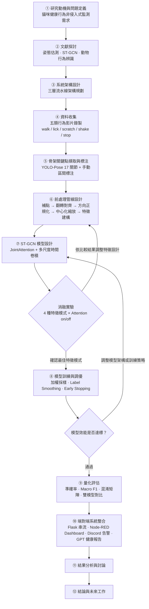

# 論文進度匯報框架

系統名稱：貓咪行為辨識系統
學生：資工碩士生
更新日期：2026-06-03

---

## 一、問題定義（Problem Definition）

### 1.1 研究背景與動機

現代家庭貓咪的健康監測多依賴飼主的主觀觀察，缺乏客觀、連續且非侵入式的量測手段。貓咪不善於表達疼痛，許多行為異常（如過度舔舐、搖頭、活動力驟降）在早期往往被忽略，導致就醫時病情已進展。

### 1.2 問題陳述

如何在不干擾貓咪的前提下，僅透過普通攝影機對貓咪進行全天候行為辨識，並於異常行為發生時自動發出預警？

### 1.3 核心挑戰

| 挑戰 | 說明 |
|---|---|
| 骨架遮蔽與缺失 | 貓咪自我理毛、蜷縮等姿態造成關鍵點遮蔽 |
| 動作邊界模糊 | 行為類別間存在過渡動作，無明確切分點 |
| 個體差異 | 不同品種體型、毛色差異影響姿態估測穩定性 |
| 即時性需求 | 系統需在消費級硬體上達到接近即時的推論速度 |

---

## 二、研究目的（Research Objectives）

1. 建構一套基於 YOLO-Pose + ST-GCN 的**非侵入式貓咪行為辨識管線**。
2. 設計並評估針對動物骨架特性的**時空前處理策略**（補點、翻轉對齊、方向正規化）。
3. 透過**消融實驗**比較四種特徵通道設計對辨識精度的影響：
   - `xy_v`（4ch）、`xy_conf_v`（5ch）、`xy_conf_v_bone`（7ch）、`xy_conf_v_bone_bmotion`（9ch）
4. 整合**端對端即時監測系統**，包含行為統計、健康警示推播與 GPT 自然語言健康分析。

---

## 三、研究方法（Research Methodology）

### 3.1 整體方法論

本研究採用**三層流水線架構（Three-Layer Pipeline Architecture）**：

```
資料流層（Data Layer）
    → 模型流層（Model Layer）
        → 服務流層（Service Layer）
```

所有參數統一集中於 `config.py`，確保訓練與推論設定一致。

---

### 3.2 資料流層（Data Layer）

**Frame 擷取**
- `cv2.VideoCapture` 讀取 MP4 / RTSP / 攝影機
- 降採樣至 30 FPS（`TARGET_MODEL_FPS`）

**骨架關鍵點偵測**
- YOLO-Pose（FP16 GPU 加速，imgsz=640，conf ≥ 0.5）
- 輸出：17 個關鍵點座標 `kpts (17, 2)` 與信心值 `kpt_conf (17,)`
- 貓體骨架關鍵點重映射（COCO 17 點 → 貓體解剖位置）：

| 索引 | 名稱 | 部位 |
|:---:|---|---|
| 0 | nose | 鼻尖 |
| 1 | left_ear_tip | 左耳尖 |
| 2 | right_ear_tip | 右耳尖 |
| 3 | chest | 前胸 |
| 4 | mid_back | 背中（翻轉與方向正規化基準點） |
| 5 | hip | 髖部（尺度縮放基準） |
| 6–9 | 前肢（左右肘、爪） | 前肢 |
| 10–13 | 後肢（左右膝、爪） | 後肢 |
| 14–16 | tail_base / tail_mid / tail_tip | 尾巴 |

**EMA 平滑**
- 以指數移動平均（EMA，α = 1.0）平滑逐幀關鍵點
- 平滑後的關鍵點用於 overlay 顯示與異常偵測

**時間序列 Buffer**
- `deque(maxlen=T=16)` 累積連續 16 幀原始關鍵點
- 每隔 `WINDOW_STRIDE = 16` 幀觸發一次 ST-GCN 推論

**前處理管線（訓練與推論共用）**

> 此管線為本研究針對動物骨架設計的核心貢獻，順序不可更動。

1. `interpolate_missing()` — 低信心關鍵點（conf < 0.5）做時序插值補點
2. `flip_normalize()` — 以 mid_back / hip 為基準做左右翻轉對齊，使骨架朝向一致
3. `orientation_normalize()` — 旋轉軀幹主軸至固定方向，消除姿態朝向差異
4. `normalize_skeleton_coords()` — 以 mid_back 為原點中心化，以胸-髖距為尺度縮放
5. `build_feature_tensor()` — 依 `FEATURE_MODE` 組合通道，排列為 `(N=1, C, T=16, V=17)`

---

### 3.3 模型流層（Model Layer）

**ST-GCN 模型架構**

```
輸入 (N=1, C, T=16, V=17)
    │
    ├── BatchNorm2d(C)
    └── JointAttention
          Conv2d(C→1) + Sigmoid → weight (N,1,T,V)
          x = bn_x × attn  （per-joint per-frame attention）
    │
    ├── Block 1  SpatialGraphConv(C→64, K=3)
    │            MultiScaleTemporalConv(k=3,5,9, stride=1)
    │            output: (N, 64, T=16, V=17)
    │
    ├── Block 2  SpatialGraphConv(64→128, K=3)
    │            MultiScaleTemporalConv(k=3,5,9, stride=2)
    │            output: (N, 128, T=8, V=17)  ← T 降採樣
    │
    ├── Block 3  SpatialGraphConv(128→128, K=3)
    │            MultiScaleTemporalConv(k=3,5,9, stride=1)
    │            output: (N, 128, T=8, V=17)
    │
    └── AdaptiveAvgPool2d(1,1) → Dropout → Linear(128→5) → Softmax
        probs: [walk, lick, scratch, shake, stop]
```

**空間圖卷積（K=3 分組）**
- A_root（自連結）、A_close（1-hop 直接鄰居）、A_further（2-hop 兩步鄰居）
- 各分組重要性為可學習參數（partition_importance）

**多尺度時間卷積**
- 三分支 k=3,5,9，分支權重以 softmax 可學習加權

**信心門檻判定**
- `confidence = max(probs)`
- confidence ≥ 0.80 → 輸出行為標籤（walk / lick / scratch / shake / stop）
- confidence < 0.80 → 輸出 LOW_CONF（顯示為「正常」，不給行為標籤）

---

### 3.4 服務流層（Service Layer）

| 元件 | 功能 |
|---|---|
| `BehaviorTracker` | 行為轉換偵測、時間累積、次數統計、今日統計（today_stats） |
| `AnomalyDetector` | 關鍵點位移計算活動力分數（EMA 平滑），偵測異常事件 |
| `CSVLogger` | 行為事件時間序列記錄（cat_monitoring_log.csv） |
| `NodeRedClient` | `POST /yolo_result` 每 0.5 秒推送行為資料到 Node-RED |
| `Visualizer` | 骨架連線、關鍵點、bbox、行為標籤、機率條 overlay |
| Flask `/stream` | MJPEG 即時串流（JPEG quality=30，約 30 FPS） |
| Flask `/status` | JSON 狀態查詢（behavior、confidence、stats） |
| Node-RED Dashboard | 即時狀態卡片、行為時間軸、詳細統計、健康警示、活動力儀表 |
| Discord Webhook | 異常行為自動告警推播 |
| GPT API | 讀取 CSV 統計，以 gpt-4.1-mini 生成繁體中文健康分析報告 |

---

### 3.5 消融實驗設計（Ablation Study）

**特徵通道比較**

| 實驗組 | FEATURE_MODE | 通道數 | 特徵內容 |
|---|---|:---:|---|
| Baseline | `xy_v` | 4 | x, y, vx, vy |
| +信心值 | `xy_conf_v` | 5 | x, y, conf, vx, vy |
| +骨段向量 | `xy_conf_v_bone` | 7 | x, y, conf, vx, vy, bone_x, bone_y |
| +骨段速度 | `xy_conf_v_bone_bmotion` | 9 | x, y, conf, vx, vy, bone_x, bone_y, bone_mx, bone_my |

**Attention 對照組**
- `STGCN_USE_ATTENTION=1`（啟用 JointAttention）vs. `=0`（Baseline 無 Attention）

**評估指標**

| 指標 | 說明 |
|---|---|
| 離散準確率（Discrete Accuracy） | argmax == true label 的比例（硬指標） |
| 真實類別平均機率（Soft Accuracy） | 真實類別的平均預測機率（信心度量） |
| Overall Accuracy | 整體正確率 |
| Macro F1 | 各類別 F1 之未加權平均（處理類別不平衡） |
| 混淆矩陣 | Row-wise recall 正規化顯示，直觀看類別間的混淆 |

**訓練策略**
- 類別加權採樣（Weighted Sampler）
- Label Smoothing
- 學習率調度（LR Scheduler）
- Early Stopping（patience = 10）
- 隨機種子固定（seed = 42）

---

## 四、研究流程（Research Flow）



---

## 五、目前進度摘要

| 階段 | 狀態 | 備註 |
|---|:---:|---|
| 研究動機與問題定義 | ✅ 完成 | |
| 文獻探討 | ✅ 完成 | |
| 系統架構設計 | ✅ 完成 | 三層架構、模組責任已定義 |
| 資料收集與標注 | ✅ 完成 | 5 類行為影片，JSON 骨架序列格式 |
| 前處理管線 | ✅ 完成 | 訓練 / 推論共用同一套，確保一致性 |
| ST-GCN 模型實作 | ✅ 完成 | JointAttention + 多尺度時間卷積 |
| 消融實驗 | ✅ 完成 | 4 特徵模式，已生成混淆矩陣與訓練曲線 |
| 雙模型對比評估 | ✅ 完成 | `eval_model_four_videos.py`，含 ★ 贏家標示 |
| 端對端系統整合 | ✅ 完成 | Flask / Node-RED / Discord / GPT 健康報告 |
| 論文撰寫 | 🔄 進行中 | |

---

## 六、關鍵參數一覽

| 項目 | 值 | 來源 |
|---|:---:|---|
| YOLO 關鍵點數量 | 17 | `YOLOConfig.TOTAL_KEYPOINTS` |
| ST-GCN 時間窗長度 | 16 幀 ≈ 0.53 秒 | `STGCNConfig.SEQUENCE_LENGTH` |
| ST-GCN 類別數 | 5 | `STGCNConfig.NUM_CLASSES` |
| ST-GCN 層數 | 3 | `STGCNConfig.NUM_LAYERS` |
| 預設特徵模式 | xy_v（4ch） | `STGCNConfig.FEATURE_MODE` |
| 行為標籤信心門檻 | 0.80 | `BehaviorTrackingConfig` |
| 關鍵點信心閾值 | 0.5 | `AnomalyDetectionConfig.KP_CONF_THRES` |
| 活動分數上限 | 20.0 | `AnomalyDetectionConfig.MAX_MOTION` |

---

## 七、系統貢獻摘要（給報告使用）

1. **針對動物骨架設計的前處理管線**：補點 → 翻轉對齊 → 方向正規化 → 中心化縮放，與人體 ST-GCN 的差異所在。
2. **JointAttention 關節注意力機制**：在 ST-GCN 骨幹前加入 per-joint per-frame 注意力加權，提升對關鍵行為部位的關注。
3. **多尺度時間卷積**：以 k=3,5,9 三分支可學習加權，同時捕捉短、中、長時間尺度的動作特徵。
4. **消融實驗驗證特徵設計**：系統性比較四種特徵通道組合，提供特徵工程選擇的實驗依據。
5. **端對端即時系統**：從攝影機輸入到 Dashboard 顯示、告警推播、GPT 健康報告，形成完整的監測閉環。

---

## 八、未來工作方向

- 多貓追蹤（Multi-cat Tracking）：目前系統僅支援單一貓咪偵測
- 擴充行為類別：飲水、進食、嘔吐等健康相關行為
- 輕量化模型部署：針對邊緣裝置（Raspberry Pi / Jetson）優化
- 長期健康趨勢分析：結合多日 CSV 數據與時間序列模型
- 數據增強：針對遮蔽、低光源、快速動作等場景補充訓練資料
