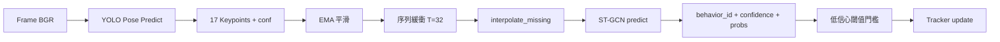

# 貓咪監測系統三層流設計

本文將系統拆分為三條可獨立分析、可交叉驗證的流程：

1. 資料流（Data Flow）
2. 服務流（Service Flow）
3. 模型流（Model Flow）

---

## 1. 資料流（Data Flow）

重點：描述資料如何從輸入一路轉換到輸出。

```mermaid
flowchart LR
    A[影片來源 Video/Camera] --> B[SharedFrameStreamer 讀幀]
    B --> C[FrameProcessor.process]
    C --> D[YOLO Keypoints]
    D --> E[Keypoints Buffer]
    E --> F[ST-GCN 行為分類]
    C --> G[AnomalyDetector]
    F --> H[BehaviorTracker]
    G --> H
    H --> I[/status JSON]
    H --> J[Node-RED JSON]
    C --> K[/stream MJPEG]
    C --> L[CSV Logs]
```

### 資料流對應程式

- 讀幀與串流快取：cat_monitoring_system/server/streaming.py
- 幀級處理主入口：cat_monitoring_system/processors/frame_processor.py
- YOLO 關鍵點：cat_monitoring_system/detectors/keypoint_detector.py
- ST-GCN 分類：cat_monitoring_system/detectors/behavior_classifier.py
- 異常與活動度：cat_monitoring_system/processors/anomaly_detector.py
- 行為統計：cat_monitoring_system/trackers/behavior_tracker.py
- API 輸出：cat_monitoring_system/server/routes.py
- CSV 記錄：cat_monitoring_system/logutils/csv_logger.py

---

## 2. 服務流（Service Flow）

重點：描述系統怎麼啟動、模組如何協作、端點如何被呼叫。

```mermaid
flowchart TD
    A[main.py 啟動] --> B[create_app]
    A --> C[send_ip_to_nodered 背景執行緒]
    B --> D[register_routes]
    D --> E[/stream]
    D --> F[/status]
    D --> G[/]
    E --> H[_ensure_processor_started]
    F --> H
    G --> H
    H --> I[_build_frame_processor]
    I --> J[SharedFrameStreamer]
```

### 服務流對應程式

- 啟動入口：cat_monitoring_system/main.py
- Flask App 工廠：cat_monitoring_system/server/flask_app.py
- 路由與 API：cat_monitoring_system/server/routes.py
- 背景串流執行緒：cat_monitoring_system/server/streaming.py
- 全域設定：config.py

---

## 3. 模型流（Model Flow）

重點：描述 AI 推論鏈路與前後處理。



### 模型流對應程式

- 偵測器封裝：cat_monitoring_system/detectors/keypoint_detector.py
- 分類器封裝：cat_monitoring_system/detectors/behavior_classifier.py
- ST-GCN 核心模型：cat_monitoring_system/models/stgcn_model.py
- 推論整合與門檻：cat_monitoring_system/processors/frame_processor.py

---

## 三層流的實務用途

1. 論文撰寫
- Data Flow 可放 Methods 的 system pipeline。
- Service Flow 可放 deployment / system architecture。
- Model Flow 可放 model inference pipeline。

2. 除錯定位
- 看不到畫面：先查服務流（路由、串流執行緒）。
- 有畫面但沒辨識：查模型流（keypoints、buffer、ST-GCN）。
- 有辨識但前端沒更新：查資料流（tracker、/status、Node-RED 推送）。

3. 後續擴充
- 替換 YOLO：主要影響模型流與資料流前段。
- 替換前端：主要影響服務流端點與資料流輸出格式。
- 新增行為類別：主要影響模型流與 tracker 映射。

---

## 最小閱讀路徑（建議）

1. 先讀 main.py 與 routes.py（理解服務流）。
2. 再讀 frame_processor.py（掌握資料流主幹）。
3. 最後讀 stgcn_model.py（理解模型流核心）。
