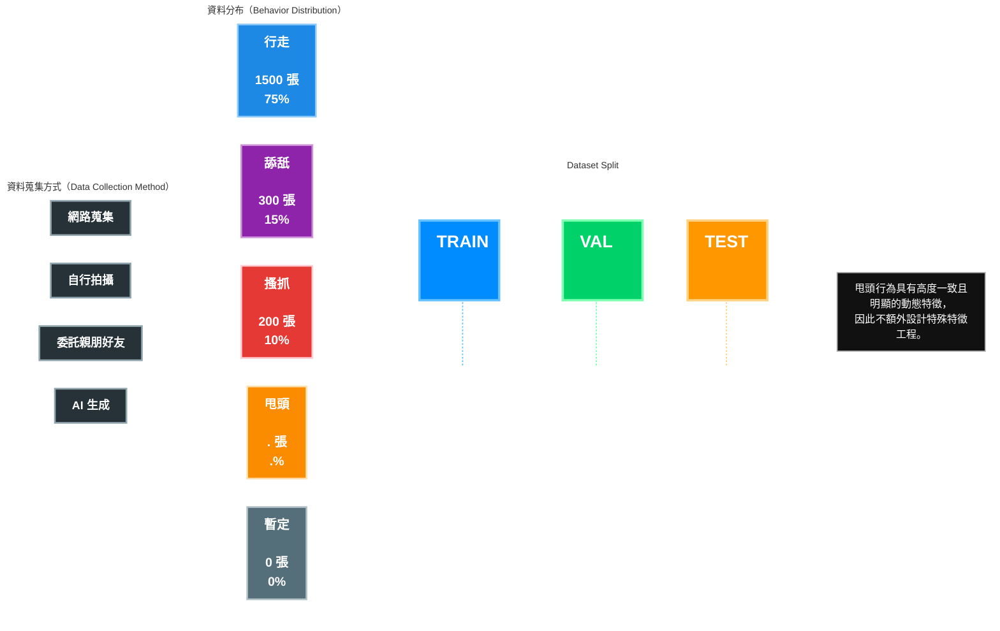

```mermaid
flowchart TB

%% =========================
%% Dataset Split
%% =========================

subgraph SPLIT["Dataset Split"]
direction TB

    subgraph TOP[" "]
    direction LR

        A["TRAIN"]:::train
        B["VAL"]:::val
        C["TEST"]:::test

    end

    subgraph BOTTOM[" "]
    direction LR

        D["1500 Images<br/>75%"]:::info
        E["300 Images<br/>15%"]:::info
        F["200 Images<br/>10%"]:::info

    end

    A -.- D
    B -.- E
    C -.- F

end

%% =========================
%% Behavior Distribution
%% =========================

subgraph DIST["資料分布（Behavior Distribution）"]
direction LR

    G["行走<br/><br/>1500 張<br/>75%"]:::walk
    H["舔舐<br/><br/>300 張<br/>15%"]:::lick
    I["搔抓<br/><br/>200 張<br/>10%"]:::scratch
    J["甩頭<br/><br/>. 張<br/>.%"]:::shake
    K["暫定<br/><br/>0 張<br/>0%"]:::stop

end

%% =========================
%% Notes
%% =========================

NOTE["甩頭行為具有高度一致且明顯的動態特徵，<br/>因此不額外設計特殊特徵工程。"]:::note

%% =========================
%% Data Collection
%% =========================

subgraph SOURCE["資料蒐集方式（Data Collection Method）"]
direction LR

    L["網路蒐集"]:::source
    M["自行拍攝"]:::source
    N["委託親朋好友"]:::source
    O["AI 生成"]:::source

end

%% =========================
%% Style
%% =========================

classDef train fill:#008CFF,color:#FFFFFF,stroke:#66C2FF,stroke-width:4px,font-size:30px,font-weight:bold
classDef val fill:#00D26A,color:#FFFFFF,stroke:#7DFFB2,stroke-width:4px,font-size:30px,font-weight:bold
classDef test fill:#FF9800,color:#FFFFFF,stroke:#FFD180,stroke-width:4px,font-size:30px,font-weight:bold

classDef info fill:none,color:#FFFFFF,stroke:none,font-size:22px,font-weight:bold

classDef walk fill:#1E88E5,color:#FFFFFF,stroke:#90CAF9,stroke-width:3px,font-size:22px,font-weight:bold
classDef lick fill:#8E24AA,color:#FFFFFF,stroke:#CE93D8,stroke-width:3px,font-size:22px,font-weight:bold
classDef scratch fill:#E53935,color:#FFFFFF,stroke:#FFCDD2,stroke-width:3px,font-size:22px,font-weight:bold
classDef shake fill:#FB8C00,color:#FFFFFF,stroke:#FFE0B2,stroke-width:3px,font-size:22px,font-weight:bold
classDef stop fill:#546E7A,color:#FFFFFF,stroke:#B0BEC5,stroke-width:3px,font-size:22px,font-weight:bold

classDef source fill:#263238,color:#FFFFFF,stroke:#90A4AE,stroke-width:3px,font-size:20px,font-weight:bold

classDef note fill:#111111,color:#FFFFFF,stroke:#AAAAAA,stroke-width:2px,font-size:18px

style A width:140px,height:140px
style B width:140px,height:140px
style C width:140px,height:140px

style SPLIT fill:none,stroke:none
style DIST fill:none,stroke:none
style SOURCE fill:none,stroke:none
style TOP fill:none,stroke:none
style BOTTOM fill:none,stroke:none

linkStyle 0 stroke:#66C2FF,stroke-width:2px,stroke-dasharray: 3 3
linkStyle 1 stroke:#7DFFB2,stroke-width:2px,stroke-dasharray: 3 3
linkStyle 2 stroke:#FFD180,stroke-width:2px,stroke-dasharray: 3 3
```
