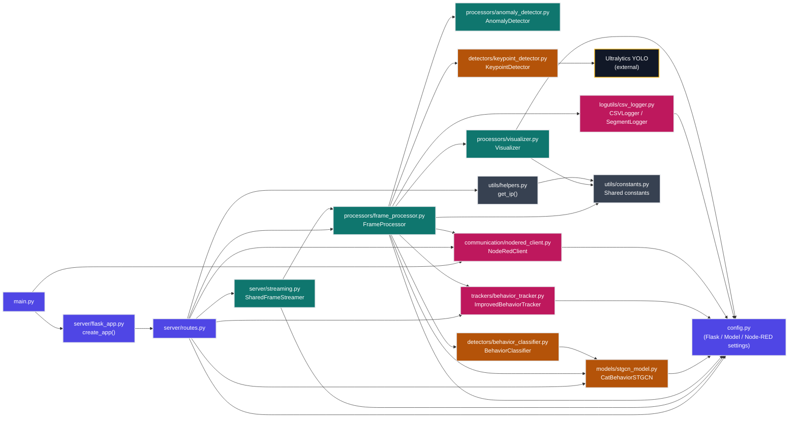

```mermaid
graph LR

    %% =========================
    %% Core Entry
    %% =========================

    main["main.py"]

    flask["server/flask_app.py<br/>create_app()"]

    routes["server/routes.py"]

    config["config.py<br/>(Flask / Model / Node-RED settings)"]


    %% =========================
    %% Streaming
    %% =========================

    streaming["server/streaming.py<br/>SharedFrameStreamer"]


    %% =========================
    %% Processing
    %% =========================

    frame["processors/frame_processor.py<br/>FrameProcessor"]

    anomaly["processors/anomaly_detector.py<br/>AnomalyDetector"]

    viz["processors/visualizer.py<br/>Visualizer"]


    %% =========================
    %% Detection / AI
    %% =========================

    keydet["detectors/keypoint_detector.py<br/>KeypointDetector"]

    behav["detectors/behavior_classifier.py<br/>BehaviorClassifier"]

    model["models/stgcn_model.py<br/>CatBehaviorSTGCN"]

    yolo["Ultralytics YOLO<br/>(external)"]


    %% =========================
    %% Tracking / Logging
    %% =========================

    tracker["trackers/behavior_tracker.py<br/>ImprovedBehaviorTracker"]

    csv["logutils/csv_logger.py<br/>CSVLogger / SegmentLogger"]


    %% =========================
    %% Communication
    %% =========================

    nodered["communication/nodered_client.py<br/>NodeRedClient"]


    %% =========================
    %% Utilities
    %% =========================

    constants["utils/constants.py<br/>Shared constants"]

    utils["utils/helpers.py<br/>get_ip()"]


    %% =========================
    %% Main Flow
    %% =========================

    main --> flask
    main --> nodered

    flask --> routes

    routes --> config
    routes --> streaming
    routes --> frame
    routes --> nodered
    routes --> tracker
    routes --> model
    routes --> utils

    streaming --> frame
    streaming --> config

    frame --> keydet
    frame --> behav
    frame --> anomaly
    frame --> viz
    frame --> tracker
    frame --> nodered
    frame --> csv
    frame --> model
    frame --> config
    frame --> constants

    behav --> model

    keydet --> yolo

    model --> config

    tracker --> config
    nodered --> config
    csv --> config

    viz --> config
    viz --> constants

    utils --> constants


    %% =========================
    %% VSCode Dark Theme Friendly
    %% =========================

    classDef core fill:#4F46E5,color:#FFFFFF,stroke:#E5E7EB,stroke-width:2px;

    classDef processing fill:#0F766E,color:#FFFFFF,stroke:#E5E7EB,stroke-width:2px;

    classDef ai fill:#B45309,color:#FFFFFF,stroke:#E5E7EB,stroke-width:2px;

    classDef tracking fill:#BE185D,color:#FFFFFF,stroke:#E5E7EB,stroke-width:2px;

    classDef utility fill:#374151,color:#FFFFFF,stroke:#E5E7EB,stroke-width:2px;

    classDef external fill:#111827,color:#FFFFFF,stroke:#FBBF24,stroke-width:2px;


    %% =========================
    %% Apply Classes
    %% =========================

    class main,flask,routes,config core;

    class streaming,frame,anomaly,viz processing;

    class keydet,behav,model ai;

    class tracker,csv,nodered tracking;

    class constants,utils utility;

    class yolo external;
```

