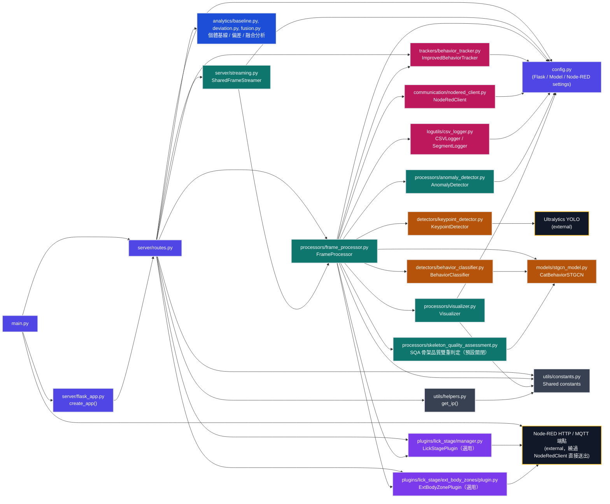

## 各模組功能總覽

> 本節僅描述各模組「負責什麼功能」，不涉及演算法細節或程式邏輯，細節請參見對應原始碼或 `0_AI_專案導覽地圖.md`。

### Core Entry（核心進入點）

- **main.py**：整個系統的啟動入口，支援「Server 模式」（啟動 Flask 伺服器）與「GUI 模式」（本機直接開窗顯示，不經過 Flask）兩種執行方式；負責啟動時的初始化流程，以及以 HTTP 直接通知 Node-RED「本機服務已上線」。
- **server/flask_app.py**：建立並組裝 Flask 應用程式本體，將所有路由註冊到伺服器上。
- **server/routes.py**：定義所有對外 HTTP 端點（影像串流、狀態查詢、行為紀錄查詢等），並負責組裝一次推論所需的完整處理管線（建立 FrameProcessor、註冊選用插件、串接分析模組）。
- **config.py**：全系統集中式設定檔，管理 Flask、YOLO、ST-GCN、Node-RED、行為追蹤、身分識別、日誌、SQA 等各面向的參數與開關。

### Streaming（影像串流）

- **server/streaming.py**：管理共用的即時影像串流緩衝，讓多個用戶端可以同時觀看同一份處理後畫面，不需各自重新推論。

### Processing（處理管線）

- **processors/frame_processor.py**：整個系統的核心處理管線，負責串接「關鍵點偵測 → 行為分類 → 異常偵測 → 骨架品質雙重判定 → 追蹤 → 視覺化 → 紀錄 → 對外通報」的完整單幀處理流程，並管理選用插件的呼叫時機。
- **processors/anomaly_detector.py**：偵測貓咪行為或姿態的異常狀況（例如長時間無移動、姿態異常等），作為行為分類之外的輔助判斷。
- **processors/visualizer.py**：負責畫面上的所有視覺化呈現，包括骨架繪製、行為標籤、機率條、疊加資訊等。
- **processors/skeleton_quality_assessment.py**：以幾何規則對骨架品質進行輔助判定（脊椎中點偏移量、脊椎中點角度、身體軸線分數抖動），在 ST-GCN 分類結果之外提供「是否可信」的第二層判斷，預設關閉、失敗時不影響主流程。

### Detection / AI（偵測與模型推論）

- **detectors/keypoint_detector.py**：呼叫 YOLO 模型偵測畫面中貓咪的關鍵點座標。
- **detectors/behavior_classifier.py**：將一段時間窗口的關鍵點序列送入 ST-GCN 模型，輸出行為分類結果與信心分數。
- **models/stgcn_model.py**：定義 ST-GCN 模型結構本身，並提供關鍵點序列的缺值補插等前處理工具函式；會依載入的權重檔自動判斷關鍵點數量、輸入通道數等模型結構參數。
- **Ultralytics YOLO（外部套件）**：提供關鍵點偵測所需的底層物件偵測/姿態估計能力。

### Tracking / Logging（追蹤與紀錄）

- **trackers/behavior_tracker.py**：追蹤行為分類結果隨時間的變化，判斷行為段落的起訖，並做平滑化與去抖動處理。
- **logutils/csv_logger.py**：將行為紀錄、行為段落等資訊寫入 CSV 檔案，供後續分析與稽核使用。

### Communication（對外通訊）

- **communication/nodered_client.py**：封裝與 Node-RED 之間的持續性資料推送（行為分類結果、狀態更新等），由 FrameProcessor 在處理管線中呼叫。
- **Node-RED HTTP / MQTT 端點（外部）**：main.py 的上線通知，以及選用插件（LickStagePlugin、ExtBodyZonePlugin）的資料回傳，皆繞過 NodeRedClient、直接以 HTTP POST 或 MQTT 送出，是與 NodeRedClient 並行的另一條對外通訊路徑。

### Analytics（個體化分析）

- **analytics/baseline.py、deviation.py、fusion.py**：提供個體日常行為基線的建立、與基線的偏差計算、以及多指標融合評估，供 server/routes.py 對外提供每日行為摘要與偏差分析端點使用。

### Plugins（選用、可插拔）

- **plugins/lick_stage/manager.py（LickStagePlugin）**：在 ST-GCN 已判定為舔舐行為時，進行舔舐動作的二階段細節分析（例如舔舐部位、持續時間等），並將結果對外回報；屬於可選擇是否啟用的附加模組，發生錯誤不影響主系統運作。
- **plugins/lick_stage/ext_body_zones/plugin.py（ExtBodyZonePlugin）**：偵測貓咪身體特定區域的接觸/停留狀況，並將統計結果寫入 CSV 或對外發布；同樣為可選擇是否啟用的附加模組，發生錯誤不影響主系統運作。

### Utilities（共用工具）

- **utils/constants.py**：集中定義全系統共用的常數（行為類別、標籤對照表等）。
- **utils/helpers.py**：提供跨模組共用的小工具函式，例如取得本機 IP、行為名稱轉換、影像來源判斷等。
