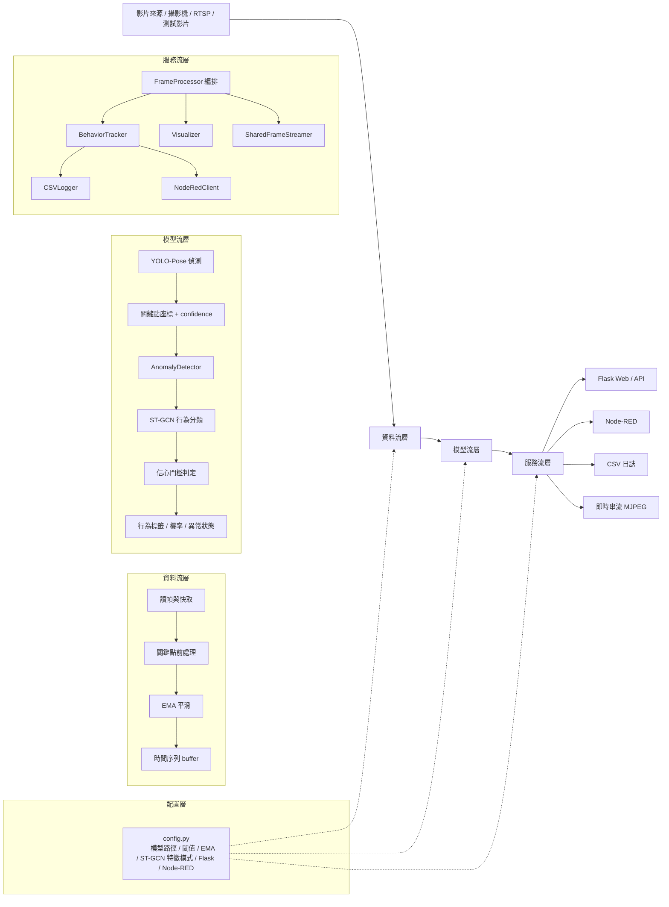
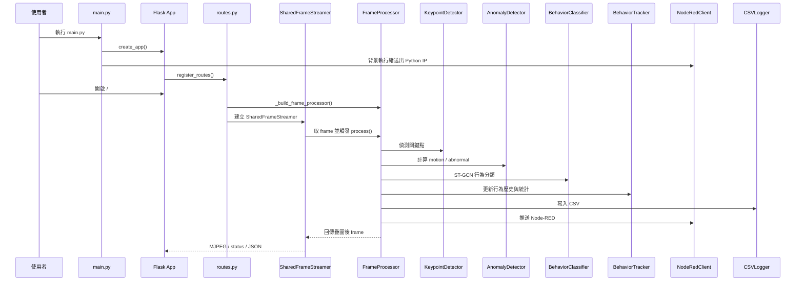

# 貓咪監測系統三層流設計

本文以目前實作為準，把系統拆成三層：

1. 資料流層 Data Pipeline
2. 模型流層 Model Inference
3. 服務流層 Service Orchestration

另外再加上一個橫向存在的配置層 Configuration Layer，因為目前大部分關鍵參數已統一放在 [config.py](config.py)。

---

## 1. 三層總覽

---

## 2. 資料流層 Data Pipeline

這一層負責把原始影像整理成可供模型推論的資料結構。它不做最終判斷，只負責「讀進來、整理好、送出去」。

### 主要工作

- 讀取影片來源或攝影機畫面。
- 把每一幀交給 `FrameProcessor` 處理。
- 從 YOLO-Pose 取得 17 個關鍵點與 confidence。
- 針對關鍵點做 EMA 平滑，降低偵測抖動。
- 將連續幀整理成 ST-GCN 所需的時間序列 buffer。

### 對應模組

- [cat_monitoring_system/server/streaming.py](cat_monitoring_system/server/streaming.py)
- [cat_monitoring_system/processors/frame_processor.py](cat_monitoring_system/processors/frame_processor.py)
- [cat_monitoring_system/detectors/keypoint_detector.py](cat_monitoring_system/detectors/keypoint_detector.py)
- [cat_monitoring_system/processors/visualizer.py](cat_monitoring_system/processors/visualizer.py)

### 這一層的輸出

- 單幀關鍵點座標 `kpts`
- 關鍵點 confidence `kpt_conf`
- EMA 平滑後的關鍵點序列
- ST-GCN 的輸入 buffer
- 疊圖後的即時畫面

---

## 3. 模型流層 Model Inference

這一層負責真正的 AI 推論與狀態判定。它會把資料流層整理好的序列送進模型，輸出行為類別、信心值和異常訊號。

### 主要工作

- YOLO-Pose 偵測貓咪姿態與關鍵點。
- `AnomalyDetector` 計算 motion score、ema motion 與 abnormal 狀態。
- ST-GCN 讀取固定長度序列，輸出五類行為機率。
- 根據信心門檻 `STGCN_BEHAVIOR_LABEL_CONFIDENCE_THRESHOLD` 決定是否顯示有效行為標籤。

### 對應模組

- [cat_monitoring_system/detectors/behavior_classifier.py](cat_monitoring_system/detectors/behavior_classifier.py)
- [cat_monitoring_system/processors/anomaly_detector.py](cat_monitoring_system/processors/anomaly_detector.py)
- [cat_monitoring_system/models/stgcn_model.py](cat_monitoring_system/models/stgcn_model.py)
- [cat_monitoring_system/processors/frame_processor.py](cat_monitoring_system/processors/frame_processor.py)

### 這一層的輸出

- `behavior_id`
- `confidence`
- `class_probs`
- `abnormal`
- `motion_score`

---

## 4. 服務流層 Service Orchestration

這一層負責把模型結果變成可用的系統服務，包含網頁、API、Node-RED 推送、CSV 記錄與串流輸出。

### 主要工作

- Flask 啟動與路由註冊。
- 首頁 `/` 顯示目前狀態。
- `/stream` 提供 MJPEG 即時影像。
- `FrameProcessor` 的結果同步給 `BehaviorTracker`、`CSVLogger`、`NodeRedClient`。

### 對應模組

- [cat_monitoring_system/main.py](cat_monitoring_system/main.py)
- [cat_monitoring_system/server/flask_app.py](cat_monitoring_system/server/flask_app.py)
- [cat_monitoring_system/server/routes.py](cat_monitoring_system/server/routes.py)
- [cat_monitoring_system/server/streaming.py](cat_monitoring_system/server/streaming.py)
- [cat_monitoring_system/trackers/behavior_tracker.py](cat_monitoring_system/trackers/behavior_tracker.py)
- [cat_monitoring_system/logutils/csv_logger.py](cat_monitoring_system/logutils/csv_logger.py)
- [cat_monitoring_system/communication/nodered_client.py](cat_monitoring_system/communication/nodered_client.py)

### 這一層的輸出

- 首頁與 API
- Node-RED JSON payload
- CSV 歷史紀錄
- 給瀏覽器看的即時串流畫面

---

## 5. 配置層 Configuration Layer

這一層不算獨立流程，但它橫跨三層，負責統一管理所有可調參數。

目前集中管理的內容包括：

- `ModelPaths`：YOLO、ST-GCN、影片來源、輸出目錄
- `YOLOConfig`：影像尺寸、confidence threshold、device
- `STGCNConfig`：sequence length、feature mode、in_channels、EMA alpha
- `AnomalyDetectionConfig`：motion 與關鍵點門檻
- `BehaviorTrackingConfig`：行為統計與 ST-GCN 標籤門檻
- `FlaskConfig`、`NodeRedConfig`：服務參數與通訊參數

這樣做的好處是：模型、服務、視覺化三邊都只讀同一份設定，不會再出現舊版那種常數分散在多個檔案的問題。

---

## 6. 啟動與資料流時序

---

## 7. 這份分層的閱讀順序

如果你要快速理解系統，建議依這個順序看：

1. 先看 [cat_monitoring_system/main.py](cat_monitoring_system/main.py) 和 [cat_monitoring_system/server/routes.py](cat_monitoring_system/server/routes.py)，先懂服務怎麼啟動。
2. 再看 [cat_monitoring_system/processors/frame_processor.py](cat_monitoring_system/processors/frame_processor.py)，理解一幀怎麼流過整個管線。
3. 最後看 [cat_monitoring_system/detectors/behavior_classifier.py](cat_monitoring_system/detectors/behavior_classifier.py) 和 [cat_monitoring_system/models/stgcn_model.py](cat_monitoring_system/models/stgcn_model.py)，理解模型怎麼做判斷。
